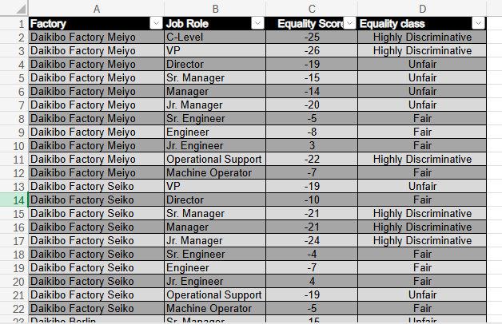
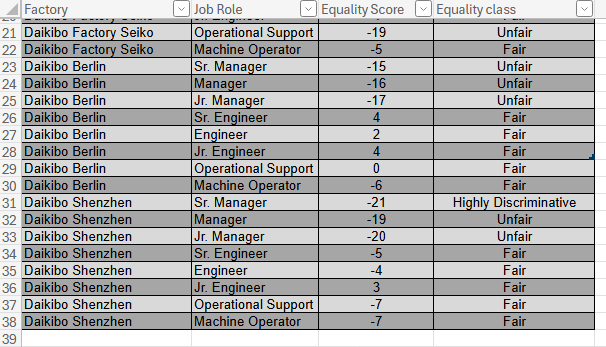
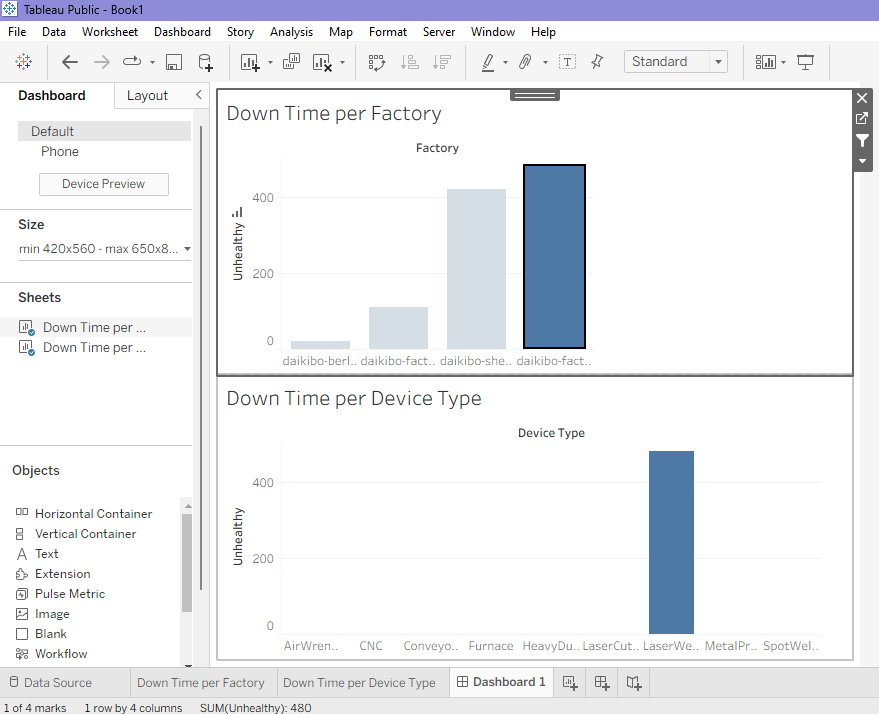

## Deloitte Data Analytics Job Simulation

Forage | Deloitte Australia

Completed the **Deloitte Data Analytics Job Simulation** on Forage, focused on applying practical data-analysis and visualization techniques to a business problem.

Overview
This project demonstrates my ability to work with structured business data, identify patterns, communicate insights, and create clear visualizations for decision-making.

Tools Used
- Microsoft Excel— Data analysis and classification.
- Tableau— Data visualization and dashboard development.
- Data Analysis — Identifying patterns, trends, and potential business insights.

## Work Completed

1. Excel — Equality Analysis
Analyzed employee compensation data to identify potential patterns and disparities across different groups.

Key work:
- Processed and analyzed the provided compensation dataset
- Examined equality-related patterns
- Classified observations based on the analysis
- Used Excel to organize and interpret the data

2. Tableau — Data Visualization

Used Tableau to analyze machine and factory data and identify potential equipment downtime.
The analysis focuses on unhealthy machine statuses, treating each unhealthy status as 10 minutes of potential downtime since the previous recorded message. The results were then visualized across factories and device types through an interactive Tableau dashboard.

Analysis Performed
1. Potential Downtime Calculation
   Created a calculated field named Unhealthy in Tableau.
   
   IF [Status] = "unhealthy" THEN 10 ELSE 0 END
   
   This converts each unhealthy machine status into 10 minutes of potential downtime, allowing downtime to be aggregated across different
   factories and device types.

3. Downtime by Factory
   
   Created a bar chart showing the total potential downtime for each factory.
   
   This makes it possible to quickly identify factories experiencing the highest amount of potential machine downtime.

5. Downtime by Device Type
   
   Created a second bar chart showing potential downtime across different device types.
   
   This helps identify which types of equipment contribute most to downtime.

7. Interactive Dashboard
   
   Combined both visualizations into a Tableau dashboard.
   
   The Factory chart was configured as an interactive filter. Selecting a factory dynamically filters the Device Type chart, allowing the
   equipment contributing to downtime within a specific factory to be investigated.

Key Finding
1. The factory with the highest potential downtime was Seiko, with more than 450 minutes of potential downtime in the analyzed data.
2. After selecting Seiko in the dashboard, the device-type analysis showed that the Laser Welder accounted for the observed downtime within the selected factory.

Tools Used

1. Tableau Public
2. Calculated Fields
3. Bar Charts
4. Interactive Dashboard Filters
5. Data Aggregation and Visualization

## Screenshot:
Excel

Tableau

Skills Demonstrated
- Data Cleaning & Preparation
- Exploratory Data Analysis
- Excel Analysis
- Data Visualization
- Tableau
- Business Insight Generation
- Analytical Problem Solving
- Communicating Data-Driven Findings

## About the Simulation
This was a **virtual job simulation completed through Forage**, designed to provide practical exposure to the type of data analytics work performed in a professional environment.

**Organization:** Deloitte Australia  
**Platform:** Forage  
**Program:** Data Analytics Job Simulation

Note: This repository contains screenshots documenting my completed work. Original simulation instructions and proprietary/reference materials are not included.

 Certificate

Certificate of completion can be provided upon request.
